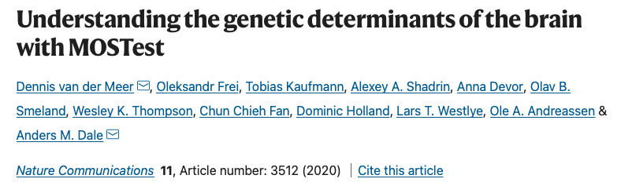

```{r setup, include=FALSE}
options(htmltools.dir.version = FALSE)
knitr::opts_chunk$set(
  fig.width=9, fig.height=3.5, fig.retina=3,
  out.width = "100%",
  cache = FALSE,
  echo = TRUE,
  message = FALSE, 
  warning = FALSE,
  hiline = TRUE
)
library(fontawesome)
library(tidyverse)
library(xaringan)
library(xaringanExtra)
library(here)
```

```{r xaringan-themer, include=FALSE, warning=FALSE}
library(xaringanthemer)

dark_yellow <- "#EFBE43"
light_yellow <- "#FDF7E9"
gray <- "#333333"
blue <- "#4466B0"
white <- "#FFFFFF"

colors = c(
Crimson = "#DC143C",
Coral = "#FF7F50",
Gold = "#FFD700",
LimeGreen = "#32CD32"
)


style_duo(
  primary_color = light_yellow,
  secondary_color = dark_yellow,
  inverse_header_color = white,
  header_color = gray,
  text_color = gray,
  code_inline_color = colorspace::lighten(gray),
  text_bold_color = colorspace::lighten(gray),
  link_color = blue,
  title_slide_text_color = blue,
  
  # fonts
  header_font_google = google_font("Martel", "300", "400"),
  text_font_google = google_font("Lato"),
  code_font_google = google_font("Fira Mono") 
  
)
```


```{r xaringanExtra, echo=FALSE, warning=FALSE}

library(xaringanExtra)
xaringanExtra::use_logo("slides/UiBlogoMED_gray_v_Eng.png",
                        width = "250px",
                        height = "250px",
                        position = xaringanExtra::css_position(top = "2em", right = "2em"))
                     

xaringanExtra::use_tile_view()

```


```{css extra.css, echo=FALSE}

.small { 
  font-size: 0.75em
}  

.bitty { 
    font-size: 1.25em;
}

.enlarge { 
    font-size: 1.5em;
}

.fade {
  opacity: 0.66;
}

```

---

background-image: url(slides/Swathy.jpeg)
background-position:cover
background-size: 700px

.footnote[Swathy & Banerjee, Epigenomics, 2017]


### **Epigenetic modifications**


---

## Background - Psychosis
.enlarge[
* Symptoms:
     - Hallucinations, delusions, loss of contact with reality <br> 
     - **Loss of insight** into their condition <br> 
     - May manifest at different stages for SCZ, BPD, MDD <br> <br />
* Treatment:
     - Antipsychotics (AP) alleviate or reduce symptoms <br> 
     - Long-term use associated with side effects <br> <br />
* Biomarkers:
     - Requires knowledge about pathophysiology & mechanisms of drug action
       
    ] 

---
## Background - Antipsychotics
.enlarge[

* Mechanism: alterations in multiple neurotransmitter systems & genes <br> <br>
 - GABA/Glutamate <br> 
 - Voltage-gated Calcium channels <br> 
 - Dopamine <br> 
 - Serotonin <br> <br> 
* Recent work suggests implications beyond synaptic biology [1,2]

    ]  
.footnote[[1] SCZ Working Group of the PGC, medRxiv, 2022;  [2] Kaar _et al._, Neuropharmacology, 2020]        
---
class: top left 

###**EWAS findings for antipsychotics** <br> <br />

.footnote[Burghardt ___et.al___, Pharmacotherapy, 2020]
.enlarge[

* Drug response-related DNAm remains poorly understood <br> <br />
* Variety of methods, tissues assayed, study designs, sample sizes <br> <br />
* Lack of consistency in reporting medication in Candidate genes & Genome-wide studies <br> <br />
* Integration of genomic data and genome-wide DNAm data may be more effective     
  ]
  

---

class: top left 
###**GWAS findings for SCZ**  <br> <br />

.footnote[SCZ Working Group of PGC, Nature, 2014; medRxiv, 2022]
.col-left[.enlarge[
 
*      ***GRIA1***, ***GRIN2A*** : Glutamate-gated ion channels <br> <br />
*     ***GABBR2*** : GABA <br> <br />
*      ***DRD2*** : Dopamine D2 receptor<br> <br />
*      ***CACNA1C*** : Calcium voltage-gated channel <br> <br />
*       ***SLC39A8*** : Manganese (Mn) transporter
]
]

---

background-image: url(slides/Hiemke_img3.jpg)
background-position:cover
background-size: 800px

###Factors influencing AP efficacy

.footnote[Hiemke _et al._, Pharmacopsychiatry 2018; Castberg _et al._, Acta Psychiatr Scand, 2017]


---

## Hypothesize: 

.enlarge[We hypothesize that AP medication is associated with differential DNA methylation in psychosis. We aim to identify:

* Common effects for antipsychotic polytherapy (n = 779) 
  

* Specific effects for antipsychotic monotherapy (n = 433)
 - Aripiprazole (n = 62)
 - Olanzapine   (n = 192)
 - Quetiapine   (n = 122)  
 - Risperdal    (n = 57)

]

---

## TOP Cohort

.enlarge[Challenges when teasing out medication effects on DNAm. <br> <br />
   - Polypharmacy <br> <br />
   - Small sample sizes of monotherapies <br> <br />
   - Missing values &#x1F641; <br> <br />
   - Model design ]
   


---
## Study/model design <br> 

.enlarge[
Approaches to consider: <br>

   - Evaluate EWAS serum AP values  <br> <br />
   - Evaluate samples as one phenotype without correction for eCells 
   ]


---

class:top left

### Models selected for Quetiapine  
* .enlarge[Serum values > 0, n = 92] <br><br> <br>

.enlarge[**Mod1**: DNAm ~ Serum1 + Serum2 + Serum_Lithium + Age + Sex + SmokingScore] <br> <br> <br />

.enlarge[**Mod2**: DNAm ~ Serum1 + Serum2 + Serum_Lithium + Age + Sex + SmokingScore + <br> <br /> Mono + Neu + NK + CD4T + CD8T + Bcells]

---

class:top left
### Results <br> <br> Genes associated with CpGs at genome-wide significance

.enlarge[
   - GLT8D1: Glycosyltransferase 8 Domain Containing 1 <br> <br />
   - SPCS1: signal peptidase complex subunit 1 <br> <br />
   - LOC100507065:long noncoding RNA <br> <br />
]
 

---
class: top left
### Manhatten plots comparing the two models 


.pull-left[Model 1: Pval = 2.92e-08, adj BH Pval = 0.017


]

.pull-right[Model 2: Pval = 2.46e-08, adj BH Pval = 0.018


]


---
### Glycosylation <br> 

### Critical in the development & function of the nervous system
.enlarge[
* cell-cell recognition <br> <br />
* axon pathfinding <br> <br />
* synaptogenesis <br> <br />
* neurotransmission <br> <br />

]

---
background-image: url(slides/Mealer_glyco.jpg)
background-position: 20% 75%
background-size: 325px

class: left top 

### Dysregulated glycosylation in SCZ 

.pull-right[.enlarge[
GluA1,***GRIA1***: glutamate; cell-surface expression <br> <br /> 
GluN2A,***GRIN2A***: glutamate; receptor localization <br> <br />
CaV1.2,***CACNA1C***: calcium;cell-surface expression <br> <br />
DR2,***DRD2***: dopamine;cell-surface expression
]
]

.pull-right[.footnote[Mealer _et al_, Molecular Psychiatry, 2020]]

---

### Phenotyes associated with GLT8D1 <br> 
**6+ variants associated with SCZ and BPD (ensembl.org)**

.enlarge[
* Stahl EA, _et al.,_ Nature Genetics, 2019 <br> <br />
* Pardiñas, _et al._, Nature Genetics, 2018 <br> <br />
* Li, _et al._, Nature Genetics, 2017 <br> <br />
* SCZ Working Group of the PGC, Nature, 2014 <br> <br />
* Ripke, _et al._, Nature Genetics, 2013 <br> <br />
* BPD Working Group of PGC, Nature Genetics, 2011
]

---
class:top left
### GLT8D1 variants identified with MOSTest

**2 variants associated with brain morphology and cortical surface area**



---
class:top left
### Differentially Methylated Regions (DMRs) <br/> 

* Regions with statistically significant methylation status

 <br> <br />

.enlarge[For lipid enthusiasts! APOB: Apolipoprotein B - ligand for LDL receptor]

---
class:top left
### Future tasks

.enlarge[
* For larger sample size & power: <br> continue analyses of AP monotherapy and adjust for polypharmacy <br><br> 
* Analyze samples with serum values > 0,  <br> **Solely on AP** (n=330) versus **Medication-free** samples (n = 131) <br><br>
* Compare CpGs/DMRs from Quetiapine with CPGs from published lipid EWAS  <br><br>
* Ask Anja for gene expression data for GLT8D1 from TOP samples &#x1F600;
]

---
class:top left
background-image: url(slides/Myrkdalen_group.png)
background-position: 10% 45%
background-size: 500px


# Acknowledgements <br>
.pull-right[
**Supervisor Stéphanie**<br><br>
**Co-Supervisor Anne-Kristin**<br><br>
**Colleagues in The Martens Group**<br><br>
**Dept. of Clinical Science II** <br><br>
**NORMENT** <br><br><br/ >

&#x1F490; **En spesiell takk til Styret i Dr Einar Martens Fond!** <br><br>


]


---


